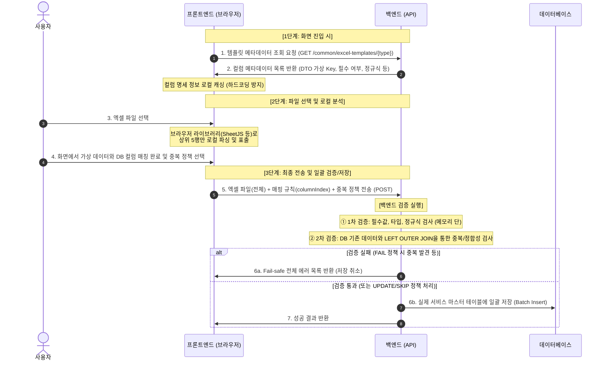

# [제안] 엑셀 업로드 및 매핑 아키텍처 개선안 (대안 C)
본 문서는 자유 형식의 엑셀 파일을 업로드하고 사용자가 화면에서 컬럼을 직접 매핑하여 저장하는 기능의 아키텍처 개선안(대안 C)을 상세히 다룹니다.

---

## 1. 아키텍처 비교 요약

| 비교 항목 | 기존 방식 (대안 A/B) | 개선 방식 (대안 C) |
| :--- | :--- | :--- |
| **핵심 메커니즘** | 엑셀 파일을 백엔드 임시 테이블에 적재 후 매핑 | 프론트 로컬 파싱 후 매핑 규칙과 함께 1회 최종 전송 |
| **임시 테이블** | 필요 (`excel_data` 테이블 생성 및 `cells01~50` 관리 필요) | **불필요** (임시 테이블 및 쓰레기 데이터 완전 제거) |
| **API 호출 횟수** | 총 3회 (업로드 ➔ 조회 ➔ 최종 매핑 저장) | **총 1회** (규격 조회 캐싱 제외, 메인 파일 전송 1회) |
| **서버 자원(I/O)** | 파일 업로드 I/O 2회, DB 임시 적재/조회/삭제 I/O 다수 발생 | 최종 저장 시 1회만 파싱 및 실제 서비스 DB 적재 |
| **보안성** | 실제 DB 구조 노출 위험 및 불투명성 존재 | DTO 필드명(가상 Key) 추상화로 **실제 DB 구조 완전 격리** |

---

## 2. 대안 C 아키텍처 개요 및 흐름

### A. 개념 정의
프론트엔드에 컬럼명을 하드코딩하지 않고, **백엔드로부터 메타데이터 정보를 조회한 뒤 브라우저에서 엑셀 상위 행을 파싱하여 매칭하는 방식**입니다.

### B. 시퀀스 다이어그램 (Sequence Diagram)



---

## 3. 핵심 설계 상세

### A. 다단 헤더(Multi-row Header) 지원 및 드래그 앤 드롭(D&D) 매핑
실제 업무용 엑셀 파일은 병합된 셀(Merge Cells)이나 다단계 구조로 인해 **상위 2~5개 행에 걸쳐 헤더(컬럼명)가 복합적으로 구성**되어 있는 경우가 많습니다. 상위 5개 행을 프론트엔드에 미리 뿌려주는 것은 이 복잡한 다단 헤더에 완벽히 대응하기 위함입니다.

1. **데이터 시작 행 지정 (`dataStartRowIndex`):**
   - 사용자가 상위 5개 행의 미리보기 화면을 보고, **"실제 데이터는 몇 번째 행부터 시작되는지"** 지정하여 백엔드로 보냅니다. (예: 1~3행은 병합된 복합 헤더이고, 실제 데이터는 4행부터 시작되는 경우 `dataStartRowIndex = 3`을 전송)
2. **드래그 앤 드롭(D&D) 인덱스 매칭:**
   - 사용자는 화면 그리드의 특정 열(예: B열, 즉 `excelColIndex = 1`)을 마우스로 잡아 백엔드 목표 규격 컬럼(예: 연락처)에 드래그하여 매칭시킵니다.
   - 프론트엔드는 이 드래그 앤 드롭 결과를 수집하여 최종 저장 시 백엔드로 해당 열의 **물리 인덱스(`excelColIndex`)**를 전송합니다.
3. **효과:**
   - 백엔드는 엑셀의 헤더 셀이 아무리 병합되어 있거나 다단계로 쪼개져 있어도 복잡한 헤더 파싱 로직을 구현할 필요가 없습니다.
   - 오직 프론트가 지정한 **`dataStartRowIndex`** 이후부터 행을 읽으며, 사용자가 드래그 앤 드롭으로 지정해 준 **`excelColIndex`** 열의 값만 콕 집어서 데이터를 추출하면 되므로 파싱이 매우 유연하고 단순해집니다.

---

### B. 파일 분석 및 가상 헤더명(Virtual Header) 처리
사용자가 업로드한 엑셀에 헤더 컬럼명이 없거나 빈 셀이 존재하는 경우의 우회 처리 메커니즘입니다.
1. **가상 헤더 생성:** 프론트엔드가 브라우저에서 엑셀 첫 행을 파싱할 때, 텍스트가 없는 열에 대해 자동으로 **"열 A", "열 B", "열 C"** (Excel 고유의 알파벳 열 주소)를 임시 컬럼명으로 부여합니다.
2. **인덱스 기반 매핑:** 사용자가 매칭을 완료하면 백엔드로 텍스트 이름이 아닌 **`columnIndex` (물리적 열 순서: 0, 1, 2...)**를 전송합니다.
3. **효과:** 컬럼명 유실이나 파일 내 컬럼명 중복이 발생하더라도 `columnIndex`를 고유 식별자로 취급하여 데이터 왜곡 없이 안전하게 파싱할 수 있습니다.

### B. 보안성 확보 (물리 DB 스키마 격리)
* 프론트엔드로 전달되는 메타데이터 내 컬럼명은 실제 물리 DB 컬럼명(예: `TB_M_EMP.CO_REG_NO`)이 아닌, 백엔드가 API 레벨에서 추상화한 **DTO 필드명(가상 Key, 예: `companyNumber`)**입니다.
* 최종 전송 시에도 프론트엔드는 가상 Key와 `columnIndex`만 보내며, 실제 DB로 SQL을 보낼 때만 백엔드 내부 Mapper에서 물리 스키마 명칭으로 맵핑 변환해 수행하므로 웹상에 내부 DB 구조가 일절 은닉됩니다.

### C. 1차 & 2차 검증 레이어 분리
백엔드 검증은 서버 자원 효율 극대화를 위해 **2단계**로 나누어 실행합니다.

1. **1차 검증: 포맷 및 타입 검증 (Syntactic Validation)**
   - **대상:** 필수 항목 누락, 데이터 타입 불일치, 정규식 포맷 어긋남 등.
   - **수행:** 파일 스트림을 읽는 도중 메모리 단에서 즉시 수행하며, 위반 사항은 `List<ValidationError>`에 일괄 수집합니다.
2. **2차 검증: DB 정합성 및 중복 검증 (Semantic Validation)**
   - **대상:** 기존 DB 테이블 데이터와의 중복 여부, 코드값 유효성(참조 키 매칭) 등.
   - **성능 최적화 (Outer 쿼리):** 1차 검증을 통과한 데이터를 기준으로 타겟 테이블을 **`LEFT OUTER JOIN`** 하는 단 한 번의 조인 쿼리를 실행해 유효하지 않은 데이터를 일괄 식별합니다.
     ```sql
     -- DB에 존재하지 않는 잘못된 부서코드를 가진 행(row_index)들을 DB단에서 일괄 추출하는 예시
     SELECT 
         temp.row_index,
         JSON_UNQUOTE(JSON_EXTRACT(temp.data_json, '$[1]')) AS invalid_value
     FROM excel_temp_data temp
     LEFT OUTER JOIN department d 
       ON JSON_UNQUOTE(JSON_EXTRACT(temp.data_json, '$[1]')) = d.dept_code
     WHERE temp.file_key = #{fileKey}
       AND d.dept_code IS NULL;
     ```

### D. 사용자 선택형 중복 정책 (Duplicate Policy)
최종 저장 API 전송 시 사용자가 결정한 `duplicatePolicy` 옵션을 동반 수신하여 분기 처리합니다.
* **`FAIL`:** DB 중복 데이터 1건이라도 발견 시 검증 실패로 규정하여 에러 목록을 반환하고 트랜잭션을 롤백합니다.
* **`UPDATE`:** 중복된 키를 가진 행은 기존 DB 레코드를 새로운 엑셀 내용으로 업데이트(Upsert/Overwrite)합니다.
* **`SKIP`:** 중복 데이터는 저장 대상에서 제외하고, 중복되지 않은 신규 데이터만 필터링하여 일괄 `INSERT` 합니다.

---

## 4. API 및 DTO 스펙 가이드라인

### 1) 템플릿 메타데이터 조회 API
* **Endpoint:** `GET /common/excel-templates/{templateType}`
* **Response Body DTO (`SysMetadata`):**
### E. 화면 직접 수정(그리드 수정) 데이터 반영 매커니즘
사용자가 원본 엑셀 파일을 다시 고쳐 업로드하지 않고, 화면 그리드에서 틀린 데이터를 즉시 수정하여 재저장할 수 있도록 백엔드는 수신된 수정 사항(`modifiedRows`)을 병합하여 검증 및 저장합니다.

```
[프론트엔드]                                             [백엔드]
     |                                                     |
     | ----- 1. 엑셀 파일(원본) + 매핑 규칙 전송 ----------> | (검증 실행)
     | <---- 2. Fail-safe 에러 목록 반환 (저장 반려) ------- |
     |                                                     |
 (오류 셀 빨갛게 표시 및 더블클릭 수정)                       |
 (수정 내역 modifiedRows 수집)                              |
     |                                                     |
     | - 3. 파일 + 매핑 규칙 + modifiedRows(수정 내역) 전송 -> | (파일 파싱 도중 수정 데이터 병합)
     |                                                     | - rowIndex 일치 시 엑셀 값 대신 수정 값 사용
     |                                                     | - 병합된 데이터로 1차/2차 재검증 돌림
     |                                                     |
     | <---- 4. 저장 성공 또는 재차 오류 피드백 ------------ | (성공 시 DB 최종 저장)
```

* **데이터 병합 로직 (Data Merging):**
  1. 백엔드는 `file`을 한 행씩 순차 파싱합니다.
  2. 현재 파싱 중인 행 번호(`rowIndex`)가 프론트엔드가 보낸 `modifiedRows` 리스트에 존재하는지 체크합니다.
  3. 존재할 경우, 엑셀 파일 내의 해당 셀 값 대신 **`modifiedRows`에 담겨 온 수정된 데이터 값**을 매핑 필드에 강제로 대입(Overwrite)하여 검증 대상 DTO를 구성합니다.
  4. 수정본이 병합된 전체 행 데이터를 대상으로 1차(포맷) 및 2차(DB) 검증을 재차 완벽하게 실행합니다.

---

## 4. API 및 DTO 스펙 가이드라인

### 1) 템플릿 메타데이터 조회 API
* **Endpoint:** `GET /common/excel-templates/{templateType}`
* **Response Body DTO (`SysMetadata`):**
  ```json
  [
    {
      "name": "사업자번호",
      "frontColumn": "companyNumber", // 프론트와 통신하는 가상 Key (물리 DB 컬럼명 CO_REG_NO 은닉)
      "dataType": "string",
      "required": true,
      "regex": "^(?:\\d{3}-\\d{2}-\\d{5}|\\d{10})$"
    },
    {
      "name": "연락처",
      "frontColumn": "phone",
      "dataType": "string",
      "required": true,
      "regex": "^(?:0[1-9]\\d{0,2}-\\d{3,4}-\\d{4}|0[1-9]\\d{7,9})$"
    }
  ]
  ```

### 2) 최종 저장 및 일괄 검증 API (화면 직접 수정 대응)
* **Endpoint:** `POST /common/save-excel-data-and-template`
* **Request Multipart Form Data:**
  - `file`: 엑셀 파일 (전체 - MultipartFile)
  - `duplicatePolicy`: "FAIL" | "UPDATE" | "SKIP" (String)
  - `dataStartRowIndex`: 실제 데이터 행이 시작되는 인덱스 (int)
  - `mappingRules` (JSON String):
    ```json
    [
      { "field": "companyNumber", "excelColIndex": 0 },
      { "field": "phone", "excelColIndex": 1 }
    ]
    ```
  - `modifiedRows` (JSON String - 선택값, 화면에서 수정한 내역):
    ```json
    [
      {
        "rowIndex": 12,
        "modified": {
          "phone": "010-1234-5678" // 12행 연락처 오타를 화면에서 수정한 값
        }
      }
      // 여러 행 수정 시 객체 다수 추가
    ]
    ```
* **Response Body DTO (검증 에러 발생 시 - Fail-safe):**
  ```json
  {
    "success": false,
    "totalRows": 150,
    "successCount": 142,
    "errorCount": 8,
    "errors": [
      { "rowNum": 12, "columnName": "연락처", "invalidValue": "010-123-456", "message": "올바른 연락처 형식이 아닙니다." },
      { "rowNum": 45, "columnName": "사업자번호", "invalidValue": "", "message": "사업자번호는 필수 값입니다." },
      { "rowNum": 89, "columnName": "사업자번호", "invalidValue": "1234567890", "message": "이미 등록된 사업자번호입니다. (DB 중복)" }
    ]
  }
  ```

---

## 5. 기대 효과

1. **DB 스토리지 및 I/O 리소스 절약:**
   임시 적재용 `excel_data` 테이블이 통째로 불필요해져 DB 스페이스 및 비정형 JSON 쿼리 비용이 0으로 수렴합니다.
2. **유지보수 비용 대폭 절감:**
   규격 변경이나 테이블 컬럼 수정 시 백엔드 `excel-templates.json` 설정 파일만 업데이트하면 프론트엔드는 배포 없이 즉시 호환되므로 동기화 에러 요소가 사라집니다.
3. **네트워크 오버헤드 감소:**
   대용량 파일을 업로드하는 불필요한 HTTP 전송 과정이 1회로 간축되어 클라이언트 체감 대기 속도가 눈에 띄게 개선됩니다.
