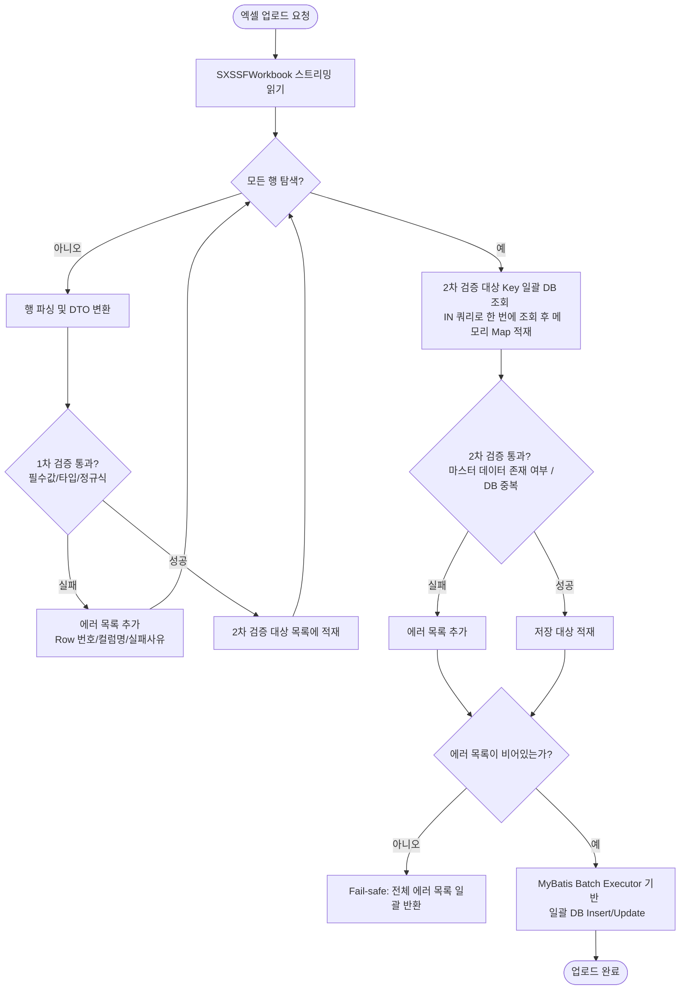

# 엑셀 업로드 유효성 검증 및 컬럼 매핑 아키텍처 제안

## 1. 기존 프로세스 문제점 분석
*   **보안 위험:** 프론트엔드가 최종 가공된 데이터를 백엔드로 전송 시 데이터 위변조 노출 위험 존재.
*   **이중 처리 비효율:** 엑셀 전체 데이터를 프론트가 2번 전송하게 되어 파싱 및 네트워크 비용 중복 발생.
*   **피드백 부재:** 유효성 오류(누락, 중복, 정규식 등)가 최종 저장 시점에만 인지됨.

---

## 2. 개선 아키텍처 모델

### 대안 A. 매핑 정보 기반 백엔드 일괄 처리 (추천 - 자유 형식 매핑 적합)
> 사용자가 자유 형식의 엑셀 파일을 업로드하면, 백엔드가 헤더 및 샘플 데이터를 추출해 주고, 프론트엔드에서 수동으로 매핑 규칙을 설정하여 파일과 함께 최종 전송하는 방식

```
[프론트엔드]                                             [백엔드]
     |                                                     |
     | ------------ 1. 자유 형식 엑셀 파일 업로드 -----------> |
     |                                                     | (헤더 추출 및 샘플 파싱)
     |                                                     | - 헤더 유실 시 가상 컬럼명 생성 (A, B, C...)
     | <--- 2. 컬럼 목록(헤더/인덱스) 및 샘플 데이터 반환 ----- |
     |                                                     |
 (화면에서 컬럼 매핑)                                        |
     |                                                     |
     | ----- 3. 파일(또는 임시 파일 ID) + 매핑 규칙 전송 -----> | (백엔드 파싱 및 유효성 검증 수행)
     |    (규칙 예: {field: "name", columnIndex: 1})        | - 매핑 인덱스(columnIndex) 기준으로 파싱
     |                                                     | - 1차 검증(포맷) & 2차 검증(DB 정합성)
     |                                                     |
     | <----------- 4. 검증 결과 피드백 (에러 목록) ---------- | (에러 존재 시 전체 에러 반환)
     |                                                     | (정상 시 실제 DB 일괄 저장)
```

### 대안 B. 임시 테이블(Stage Table) 단계 도입 (대용량/편집 기능 요구 시 추천)
> 엑셀 데이터를 임시 테이블에 선적재 후, 검증 결과를 화면에 보여주며 사용자가 수정할 수 있게 유도하는 방식 (자유 형식 매핑과 결합 가능)

### 대안 C. 프론트엔드 로컬 파싱 + 백엔드 메타데이터 API 조회 (유지보수 및 단순성 최우선 추천)
> 프론트엔드에 컬럼명을 하드코딩하지 않고, 백엔드로부터 메타데이터 정보를 조회한 뒤 브라우저에서 엑셀 상위 행을 파싱하여 매칭하는 방식

```
[프론트엔드]                                             [백엔드]
     |                                                     |
     | ----- 1. 메타데이터 조회 API 요청 (템플릿 타입별) -----> |
     | <---- 2. 컬럼 메타데이터 목록 반환 (필수값, 타입 등) ---- |
     |                                                     |
 (엑셀 선택 시 SheetJS 등으로)                              |
 (브라우저 상에서 상위 5행 파싱)                             |
 (화면에서 컬럼 매핑 완료)                                  |
     |                                                     |
     | --- 3. 엑셀 파일(전체) + 매핑 규칙 + 중복 정책 전송 ---> | (백엔드 파싱 및 유효성 검증 수행)
     |                                                     | - 1차 검증(포맷) & 2차 검증(DB 정합성)
     |                                                     |
     | <--------- 4. 최종 저장 결과 또는 에러 피드백 -------- | (정상 시 실제 DB에 즉시 저장)
```
- **특징:** 백엔드에 데이터를 임시 적재할 **임시 테이블(`excel_data`) 자체가 불필요**해지며, 통신 횟수가 줄어들어 구조가 매우 깔끔해집니다.
- **보안성 확보 (물리 DB 구조 비노출):**
  - 프론트엔드로 전달하는 메타데이터 컬럼명은 실제 물리 DB 컬럼명(예: `TB_COMP_CO_REG_NO`)이 아닙니다.
  - 백엔드가 제공하는 API 전송용 가상 필드명(예: Java DTO 필드명인 `companyNumber`)으로 **추상화/앨리어싱(Obfuscation/Aliasing)**하여 제공합니다.
  - 따라서 브라우저에는 실제 DB 구조가 절대 노출되지 않으며, 백엔드가 최종 저장 쿼리를 실행할 때 내부적으로 DTO ➔ 물리 DB 컬럼으로 매핑하여 안전하게 저장합니다.

---

## 3. 백엔드 검증 대상 (주요 체크리스트)

### A. 템플릿 및 헤더 검증 (최우선 수행 - 자유 형식 대응)
자유 형식 업로드의 경우 고정 템플릿이 아니므로, 헤더가 손상되었거나 없을 때의 우회 메커니즘을 적용합니다.
*   **헤더 유실 시 가상 컬럼명(Virtual Header) 자동 부여:**
    - 엑셀의 첫 번째 행에서 컬럼명이 읽히지 않거나(빈 셀), 헤더 자체가 없는 파일인 경우 백엔드는 파싱을 중단하지 않습니다.
    - 대신, **"열 A", "열 B", "열 C"** (또는 Excel 열 문자인 A, B, C...)와 같이 **가상의 컬럼명**을 매핑용 헤더로 임시 부여하여 프론트엔드로 내려줍니다.
*   **인덱스(순서) 기반 매핑 규칙 강제:**
    - 사용자가 화면에서 매핑을 완료한 후 백엔드에 규칙을 보낼 때, `columnName`(텍스트)이 아닌 **`columnIndex`(물리적 열 인덱스: 0, 1, 2...)**를 기준으로 규칙을 구성하도록 설계합니다.
    - **이유:** 컬럼명이 비어있거나, 엑셀 파일 내에 동일한 컬럼명이 중복해서 존재하더라도 `columnIndex`를 기준으로 삼으면 중복/유실 문제 없이 정확한 매핑 및 데이터 추출이 가능하기 때문입니다.

### B. 데이터 필드 검증
*   **누락 검증 (Null check):** 필수값 매핑 필드의 누락 여부
*   **중복 검증 (Duplication check):** 
    중복 검증은 발생 시나리오에 따라 **두 가지 단계**로 분류하여 정합성을 체크합니다.
    1.  **엑셀 파일 내부 중복 (Excel-Internal Duplication):**
        - **내용:** 업로드한 엑셀 파일 내에서 동일한 유니크 키(예: 사번, 사업자번호 등)를 가진 데이터가 여러 행에 중복으로 존재하는 경우입니다. (예: 10행과 50행에 동일한 사번 'EMP01'이 입력됨)
        - **검증 방식:** 백엔드 메모리 상에서 Set 또는 GroupBy를 활용해 동일 식별자의 출현 빈도가 2회 이상인 행들을 검출합니다.
    2.  **DB 기존 데이터와의 중복 (DB-Existing Duplication):**
        - **내용:** 엑셀 파일 내에는 중복이 없으나, 입력된 유니크 키가 실제 운영 DB 테이블에 이미 등록되어 존재하는 경우입니다.
        - **검증 방식:** 앞서 제안한 **Outer JOIN 쿼리**를 통해 DB 기존 데이터와 결합했을 때 조인이 성공하는(이미 DB에 있는) 행들을 중복 데이터로 검출합니다.
        - **사용자 선택형 중복 처리 정책 (Duplicate Policy 옵션 추가):**
            최종 저장 요청 DTO에 사용자가 선택한 중복 처리 옵션(`duplicatePolicy`)을 수신하여 다르게 처리합니다.
            - **`FAIL` (에러/반려):** DB 중복 검출 시 에러 목록(`List<ValidationError>`)에 추가하고 저장을 중단합니다. (사용자에게 "기존 데이터가 존재합니다. 덮어쓰기 여부를 선택하세요." 가이드 제공 가능)
            - **`UPDATE` (덮어쓰기):** 중복된 행에 대해 에러 처리를 하지 않고, 기존 DB 데이터를 엑셀의 신규 내용으로 업데이트(Upsert)합니다.
            - **`SKIP` (건너뛰기):** 중복된 행은 저장 대상에서 제외하고, 중복되지 않은 신규 데이터만 필터링하여 일괄 `INSERT` 합니다.
*   **정규식 검증 (Regex validation):** 이메일, 전화번호, 날짜 등 형식 준수 여부

---

### C. 요청 DTO 확장 방안 (Request Parameter 추가)
사용자가 화면에서 중복 처리 옵션을 정할 수 있도록 `/common/save-excel-data-and-template` API의 요청 스키마를 아래와 같이 확장합니다.

* **`ExcelApiDto.SaveDataAndTemplateRequest` 예시:**
  ```java
  public static class SaveDataAndTemplateRequest {
      private List<ModifiedRow> modifiedRows;
      private TemplateDto templateData;
      private List<List<Map<String, String>>> mappedData;
      
      // 사용자 선택형 중복 정책 옵션 (FAIL, UPDATE, SKIP)
      @NotBlank(message = "중복 처리 정책 옵션은 필수입니다.")
      private String duplicatePolicy; 
  }
  ```

---

## 4. 백엔드 검증 아키텍처 및 상세 설계 방안

### A. 검증 레이어의 분리 및 흐름 상세
백엔드 검증은 시스템 자원을 효율적으로 사용하고 DB 오버헤드를 방지하기 위해 **1차(포맷/타입) 검증**과 **2차(DB 비즈니스 규칙) 검증**으로 엄격히 분리하여 처리합니다.



#### 1. 1차 검증: 포맷 및 타입 검증 (Syntactic Validation)
*   **원리:** DB 조회 없이 CPU와 메모리 자원만으로 즉시 판별 가능한 구문적 검증입니다.
*   **검증 대상:**
    - 필수 항목의 누락 여부 (Null/Empty 체크)
    - 데이터 타입 일치 여부 (예: 나이 컬럼에 문자가 들어왔는지 등)
    - 정규식 형식 준수 (예: 이메일, 전화번호, 날짜 YYYY-MM-DD 등)
*   **이점:** 잘못된 형식의 데이터가 DB 조회 작업(I/O 비용 발생)으로 넘어가지 않도록 앞단에서 차단합니다.
*   **구현 방법:** DTO 클래스에 `jakarta.validation` 어노테이션(`@NotBlank`, `@Pattern`, `@Size` 등)을 선언하고, 각 Row 파싱 시점에 Validator를 호출하여 유효성을 검증하고 에러를 수집합니다.

#### 2. 2차 검증: 비즈니스 규칙 및 참조 검증 (Semantic Validation)
*   **원리:** 1차 검증을 무사히 통과한 데이터만을 대상으로, 실제 데이터베이스의 데이터 정합성을 비교하는 비즈니스 검증입니다.
*   **검증 대상:**
    - 마스터 데이터 존재 여부 검사 (예: 입력한 부서코드 `D101`이 실제 DB `DEPARTMENT` 테이블에 등록된 코드인가?)
    - 시스템 내 중복 검사 (예: 엑셀의 이메일 정보가 이미 기존 가입자 중복 데이터인가?)
*   **성능 최적화 (DB Outer Join 쿼리 활용):**
    - **개념:** 자바 애플리케이션 메모리로 수천 건의 데이터를 읽어와서 루프를 돌며 검증하는 대신, 임시 적재 테이블(`excel_data`)과 실제 운영 테이블(예: `company`)을 **`LEFT OUTER JOIN`**하여 DB 레벨에서 불일치 데이터나 중복 데이터를 한 번에 검출하는 방식입니다.
    - **JSON 파싱 기반 Outer Join 예시:**
      임시 테이블의 `data_json` 컬럼이 JSON Array 형식이므로, 사용자가 매핑한 `columnIndex`(예: 1번째 열이 사업자번호인 경우)를 기반으로 SQL 내에서 JSON 추출 함수를 사용해 조인합니다.
      ```sql
      -- DB에 존재하지 않는 잘못된 사업자번호를 가진 행(row_index) 일괄 검출
      SELECT 
          temp.row_index,
          JSON_UNQUOTE(JSON_EXTRACT(temp.data_json, '$[1]')) AS invalid_value
      FROM excel_data temp
      LEFT OUTER JOIN company c 
        ON JSON_UNQUOTE(JSON_EXTRACT(temp.data_json, '$[1]')) = c.company_number
      WHERE temp.file_key = #{fileKey}
        AND c.company_number IS NULL; -- DB에 존재하지 않는 경우 필터링
      ```
    - **이점:**
      - 단 한 번의 쿼리 요청으로 수만 건의 비즈니스 검증 처리가 가능하여 네트워크 및 DB 오버헤드가 극적으로 감소합니다.
      - 불일치하거나 중복된 데이터가 있는 **행 번호(`row_index`)**와 잘못된 입력값을 아주 쉽게 특정할 수 있어 프론트엔드에 `Fail-safe` 구조의 에러 피드백을 전달하기 용이합니다.

---

### B. 에러 피드백 구조 디자인 (Error Collection Strategy)
사용자에게 친화적인 에러 피드백을 제공하기 위해 **Fail-safe(전체 검사 후 일괄 에러 반환)** 방식을 기본으로 합니다.

* **Response DTO 구조 예시:**
  ```json
  {
    "success": false,
    "totalRows": 150,
    "successCount": 142,
    "errorCount": 8,
    "errors": [
      { "rowNum": 12, "columnName": "email", "invalidValue": "test@com", "message": "올바른 이메일 형식이 아닙니다." },
      { "rowNum": 45, "columnName": "employeeNo", "invalidValue": "", "message": "사원번호는 필수 값입니다." },
      { "rowNum": 89, "columnName": "departmentCode", "invalidValue": "D999", "message": "존재하지 않는 부서 코드입니다." }
    ]
  }
  ```

---

### C. 대용량 엑셀 처리 및 성능 최적화
* **메모리(OOM) 문제 대응:** 
  - 일반적인 `XSSFWorkbook`은 수만 건 이상의 데이터를 처리할 때 JVM 메모리 부족 현상을 일으킬 수 있습니다.
  - **대안 C-1:** Apache POI의 `SXSSFWorkbook` (Streaming Version) 사용.
  - **대안 C-2:** 성능이 우수하고 메모리 사용량이 극히 적은 Naver의 `EasyExcel` 혹은 가벼운 외부 SAX 기반 라이브러리 도입 검토.
*   **DB 쓰기 성능 최적화:**
    - 검증 완료된 데이터 저장 시, 단건 `INSERT`가 아닌 MyBatis의 Batch Executor 활용 또는 Multi-row `INSERT` 쿼리 작성을 통해 네트워크 및 트랜잭션 오버헤드 최소화.

---

## 5. 최종 결정된 엑셀 임포트 아키텍처 (대안 C 및 화면 직접 수정)
논의를 통해 다음과 같이 최종 아키텍처 스펙을 확정하였습니다. 상세한 기술 명세서는 [excel_import_architecture_c.md](file:///home/gahz/cp7/sa_cp7-back/excel_import_architecture_c.md)에 보관 중입니다.

### A. 주요 아키텍처 스펙
1. **임시 테이블 배제:** 데이터 임시 적재용 `excel_data` 테이블을 걷어내고, 백엔드로의 최종 1회 저장 요청 시 엑셀 파일과 매핑 규칙을 한 번에 전송받아 즉시 검증 및 저장합니다.
2. **다단 헤더 & D&D 매핑:** 
   - 프론트엔드가 브라우저 로컬에서 상위 5개 행을 파싱하여 다단 헤더 레이아웃에 대응하고, 사용자가 드래그 앤 드롭을 통해 DB 타겟 컬럼에 매핑합니다.
   - 백엔드는 매핑된 `excelColIndex`와 데이터 시작 인덱스(`dataStartRowIndex`)를 활용해 인덱스 기반으로 단순하고 유연하게 파싱합니다.
3. **화면(그리드) 직접 수정 반영:**
   - 저장이 반려(Fail-safe 에러 응답)되면 사용자는 화면 상에서 값을 더블클릭하여 바로 수정합니다.
   - 재저장 시 수정 내역(`modifiedRows`)을 파일과 함께 전송하며, 백엔드는 파싱 시 `rowIndex`가 일치하는 행의 데이터를 엑셀 원본 값 대신 수정된 값으로 교체(Merge)하여 검증 및 저장을 수행합니다. (시퀀스 다이어그램 반영 완료)
4. **보안 강화 (Aliasing):**
   - 백엔드는 실제 물리 DB 컬럼명을 노출하지 않고, API DTO 필드명(Logical Key, 예: `companyNumber`)으로 메타데이터를 추상화해 프론트와 연동합니다.
5. **1차 검증용 타입별 유효성 검증 함수:**
   - `string`, `number`(`isValidNumber`), `date`(`isValidDate`), `boolean`(`isValidBoolean`)에 대한 백엔드 전처리기 함수 명세를 반영하였습니다. (2026-06-23 추가)
